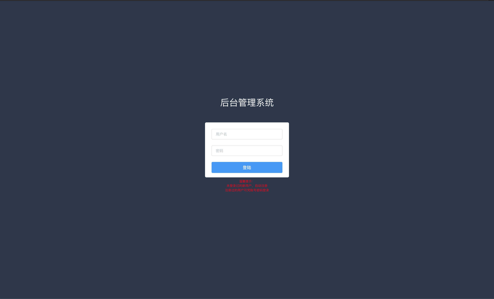
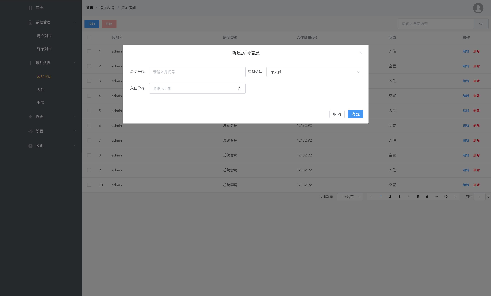
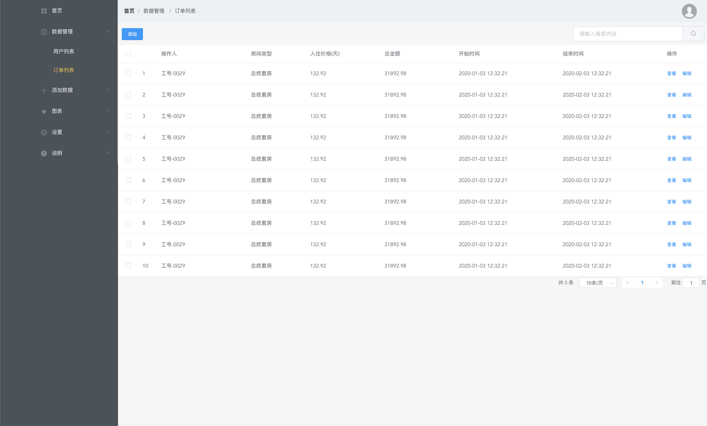
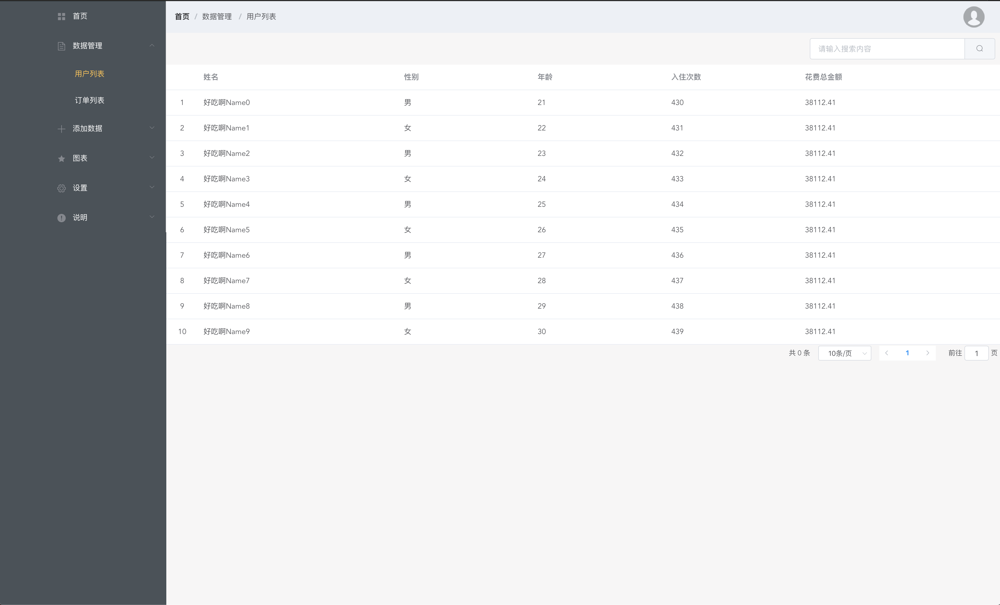
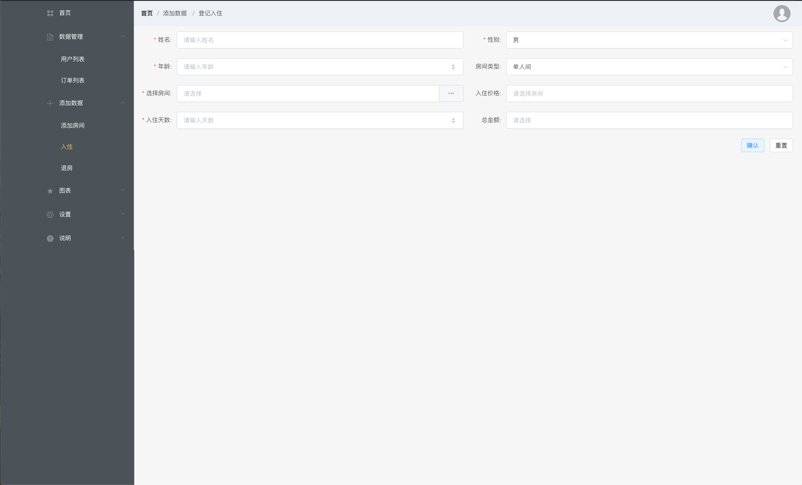

# vue2-manage

基于 vue 和 element-ui 实现的管理系统，练手项目

1. 这只是一个简单的练手项目，里面有部分工具类、简单的网络请求封装（不过没有自己实现接口，因为只是为了练手）、还有 vuex 全局值的使用，主要在
   login 文件夹中，有很多注释代码。
2. 把 vue、js 和 css 文件分开，使得每一个文件的代码行数降低，避免如果逻辑复杂出现很难维护的情况
3. 还有一些细节没完成，包括首页的部分数据展示、关于我们等等

## 技术栈

vue2 + vuex + vue-router + webpack + ES6/7 + less + element-ui

以下是功能截图

### 登录界面

### 添加房间

### 订单列表

### 用户列表

### 登记入住

